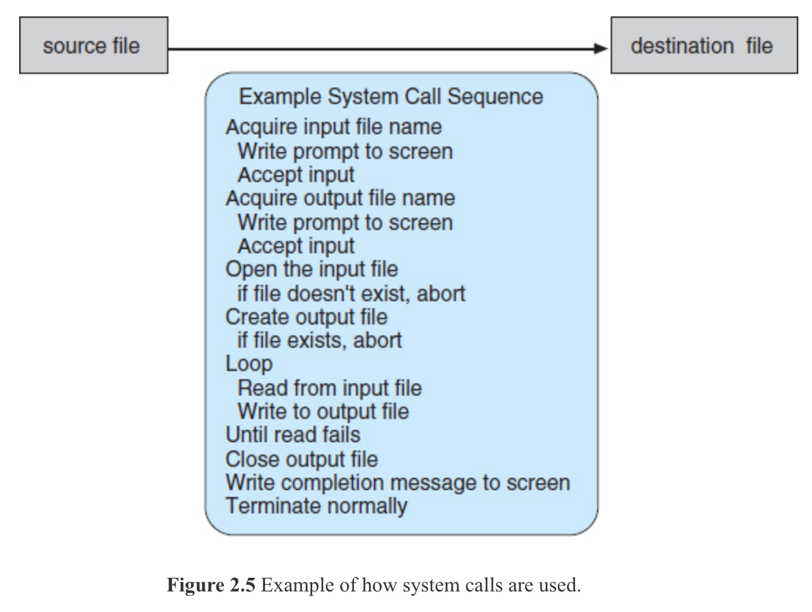

# Introduksjon i Windows API
* [Windows API](https://en.wikipedia.org/wiki/Windows_API)
* [STARTUPINFO](https://docs.microsoft.com/en-us/windows/win32/api/processthreadsapi/ns-processthreadsapi-startupinfoa)
* [main( VOID )](https://www.geeksforgeeks.org/difference-int-main-int-mainvoid/)
* [ZeroMemory](https://docs.microsoft.com/en-us/previous-versions/windows/desktop/legacy/aa366920(v=vs.85))
* [Process creation flags](https://docs.microsoft.com/en-us/windows/win32/procthread/process-creation-flags)
* [WaitForSingleObject](https://docs.microsoft.com/en-us/windows/win32/api/synchapi/nf-synchapi-waitforsingleobject)
* [CloseHandle](https://docs.microsoft.com/en-us/windows/win32/api/handleapi/nf-handleapi-closehandle)
* [PROCESS_INFORMATION](https://docs.microsoft.com/en-us/windows/win32/api/processthreadsapi/ns-processthreadsapi-process_information)

# Kopiering av fil

| Oppgave                             | Underoppgaver                 |
| ----------------------------------- | ----------------------------- |
| Anskaffe filnavn som skal kopieres  | Skrive en prompt til skjermen |
|                                     | Aksepter inn-data             |
| Anskaffe filnavn for kopien         | Skrive en prompt til sjermen  |
|                                     | Aksepter inn-data             |

**prompt** - Oxford English Dictionary beskriver begrepet slikt:
> Computing. A word, symbol, or message automatically displayed on a screen to indicate that input is required from the user.

[NAOB](https://naob.no/ordbok/prompt_2) tilbyr følgende definisjon:
> IT, PÅ DATASKJERM  tegn i form av en (som regel blinkende) markør på kommandolinje

